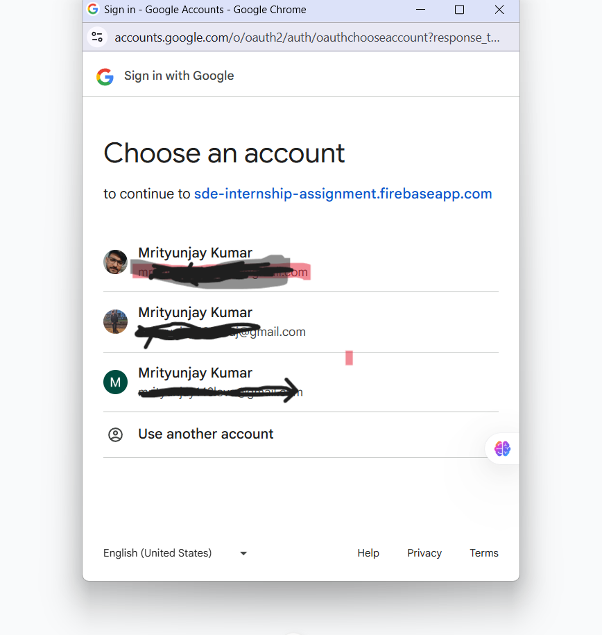

<<<<<<< HEAD
# Programming Challenge Platform

A modern web application built with Nuxt 3, Firebase Authentication, and Firestore that allows users to solve programming challenges and submit their solutions.

## 🚀 Features

### 👤 User Features
- **Google Sign-In**: Secure authentication using Firebase Auth
- **Programming Challenges**: Interactive coding challenges with syntax highlighting
- **Code Editor**: Built-in editor with support for multiple programming languages
- **Solution Submission**: Submit and track your coding solutions
- **Previous Submissions**: View and load your previous attempts

### 🛠️ Admin Features
- **Admin Dashboard**: Comprehensive overview of all submissions and statistics
- **User Management**: Add/remove admin privileges for users
- **Submission Monitoring**: View all user submissions with detailed information
- **Analytics**: Track submission statistics by language and user activity

## 🏗️ Tech Stack

- **Frontend**: Nuxt 3, Vue 3, Tailwind CSS
- **Backend**: Firebase (Auth + Firestore)
- **Code Editor**: CodeMirror 6
- **State Management**: Pinia
- **Styling**: Tailwind CSS with custom components

## 📦 Installation

1. **Clone the repository**
   ```bash
   git clone <your-repo-url>
   cd programming-challenge
   ```

2. **Install dependencies**
   ```bash
   npm install
   ```

3. **Set up Firebase**
   - Create a new Firebase project at [Firebase Console](https://console.firebase.google.com)
   - Enable Authentication with Google provider
   - Create a Firestore database
   - Copy your Firebase config

4. **Environment Setup**
   ```bash
   cp .env.example .env
   ```
   Fill in your Firebase configuration:
   ```env
   FIREBASE_API_KEY=your_api_key_here
   FIREBASE_AUTH_DOMAIN=your_project_id.firebaseapp.com
   FIREBASE_PROJECT_ID=your_project_id
   FIREBASE_STORAGE_BUCKET=your_project_id.appspot.com
   FIREBASE_MESSAGING_SENDER_ID=your_sender_id
   FIREBASE_APP_ID=your_app_id
   ```

5. **Deploy Firestore Rules**
   ```bash
   firebase deploy --only firestore:rules
   ```

6. **Add Initial Admin** (manually in Firestore console)
   - Go to Firestore Database
   - Create collection `admins`
   - Add document with ID as your email address
   - Add fields:
     ```json
     {
       "addedBy": "system",
       "addedAt": "2024-01-01T00:00:00.000Z",
       "email": "your-email@example.com"
     }
     ```

## 🚀 Development

```bash
# Start development server
npm run dev
```

Visit `http://localhost:3000`

## 🏗️ Build & Deploy

```bash
# Build for production
npm run build

# Generate static site
npm run generate

# Preview production build
npm run preview
```
## 📸 Screenshots

### 🖼️ Home Page


### 🧾 Challenge Page


### 📄 Submission Page


### 📊 Admin Dashboard


### 🔐 Login Page


### 📁 User Profile


## 📁 Project Structure

```
programming-challenge/
├── components/
│   ├── AdminDashboard.vue      # Main admin interface
│   ├── CodeEditor.vue          # Code editing component
│   ├── SubmissionsList.vue     # Display all submissions
│   └── UserManagement.vue      # Admin user management
├── layouts/
│   └── default.vue             # App layout with navigation
├── middleware/
│   ├── auth.ts                 # Authentication middleware
│   └── admin.ts                # Admin access middleware
├── pages/
│   ├── index.vue               # Landing page
│   ├── login.vue               # Login page
│   ├── question.vue            # Challenge solving page
│   └── admin/
│       └── index.vue           # Admin dashboard
├── plugins/
│   └── firebase.client.ts      # Firebase initialization
├── stores/
│   ├── auth.ts                 # Authentication store
│   ├── admin.ts                # Admin management store
│   └── submissions.ts          # Submissions management
├── assets/css/
│   └── main.css                # Global styles
└── firestore.rules             # Firestore security rules
```

## 🔐 Security

The application implements comprehensive security measures:

- **Authentication**: Required for all protected routes
- **Authorization**: Admin-only access to sensitive operations
- **Firestore Rules**: Server-side security for database operations
- **Input Validation**: Client and server-side validation
- **XSS Protection**: Sanitized user inputs

## 🎯 Usage

### For Regular Users
1. **Sign Up/Login**: Use Google Sign-In to authenticate
2. **View Challenge**: Navigate to the programming challenge
3. **Write Solution**: Use the built-in code editor with syntax highlighting
4. **Submit Code**: Submit your solution to be saved and tracked
5. **View History**: Access your previous submissions

### For Administrators
1. **Access Dashboard**: Navigate to `/admin` (requires admin privileges)
2. **View Submissions**: Monitor all user submissions with filtering options
3. **Manage Admins**: Add or remove admin privileges from users
4. **Analytics**: View submission statistics and user activity

## 🔧 Configuration

### Adding New Programming Languages

To add support for additional programming languages:

1. **Install language support**:
   ```bash
   npm install @codemirror/lang-<language>
   ```

2. **Update CodeEditor.vue**:
   ```javascript
   import { <language> } from '@codemirror/lang-<language>'
   
   const getLanguageExtension = (lang) => {
     switch (lang) {
       case '<language>':
         return <language>()
       // ... other cases
     }
   }
   ```

3. **Add placeholder template** in `getPlaceholder()` function

### Customizing Questions

Currently uses a default prime numbers challenge. To add more questions:

1. **Create questions collection** in Firestore
2. **Update submissions store** to fetch from questions collection
3. **Modify question display** components

## 📊 Database Schema

### Collections

**users**
```javascript
{
  email: string,
  displayName: string,
  photoURL: string,
  createdAt: timestamp,
  lastLoginAt: timestamp
}
```

**submissions**
```javascript
{
  userEmail: string,
  userName: string,
  questionId: string,
  questionTitle: string,
  code: string,
  language: string,
  submittedAt: timestamp
}
```

**admins**
```javascript
{
  email: string,
  addedBy: string,
  addedAt: timestamp
}
```

## 🚨 Troubleshooting

### Common Issues

1. **Firebase Connection Issues**
   - Verify Firebase config in `.env`
   - Check Firebase project settings
   - Ensure Firestore is enabled

2. **Authentication Problems**
   - Verify Google Auth is enabled in Firebase Console
   - Check authorized domains in Firebase Auth settings

3. **Permission Denied**
   - Check Firestore rules are deployed
   - Verify user has proper admin privileges

4. **CodeMirror Not Loading**
   - Clear browser cache
   - Check console for JavaScript errors
   - Fallback textarea should appear

### Performance Optimization

- **Code Splitting**: Automatically handled by Nuxt 3
- **Image Optimization**: Use `nuxt/image` for profile pictures
- **Lazy Loading**: Implement for submission lists
- **Caching**: Configure Firebase hosting cache headers

## 🤝 Contributing

1. Fork the repository
2. Create a feature branch: `git checkout -b feature/amazing-feature`
3. Commit changes: `git commit -m 'Add amazing feature'`
4. Push to branch: `git push origin feature/amazing-feature`
5. Open a Pull Request

## 📝 License

This project is licensed under the MIT License - see the [LICENSE.md](LICENSE.md) file for details.

## 🙏 Acknowledgments

- **Nuxt 3** - The Intuitive Vue Framework
- **Firebase** - Google's mobile and web application development platform
- **CodeMirror** - Versatile text editor implemented in JavaScript
- **Tailwind CSS** - Utility-first CSS framework
- **Pinia** - The Vue Store that you will enjoy using

## 📞 Support

For support and questions:
- Create an issue in the GitHub repository
- Check the documentation
- Review Firebase console for backend issues

---

**Happy Coding! 🚀**
Made with ❤️ by **Mrityunjay Kumar**
=======
# CodeChallenge
>>>>>>> 19a3e0546c7a0c831ec64d4e883b59476bee0192
